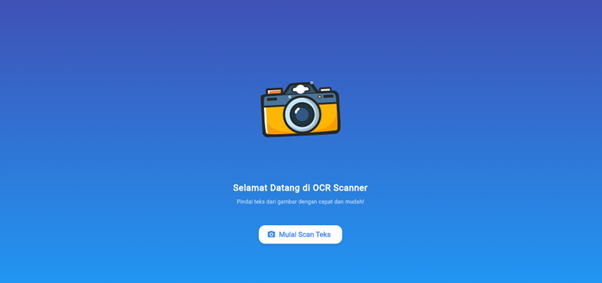
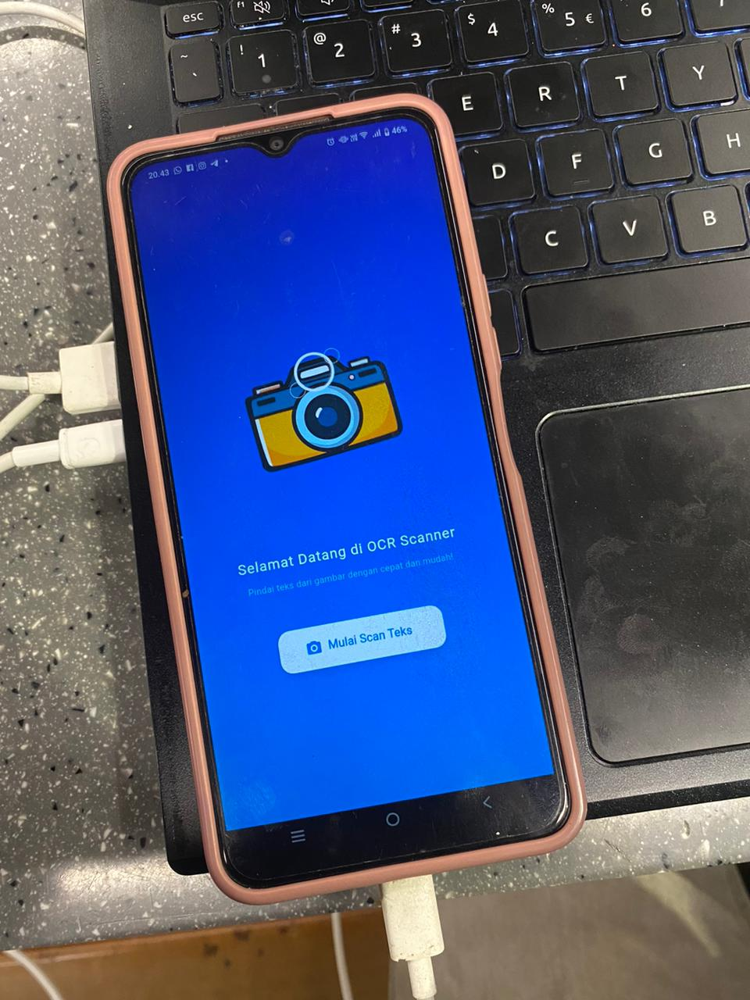
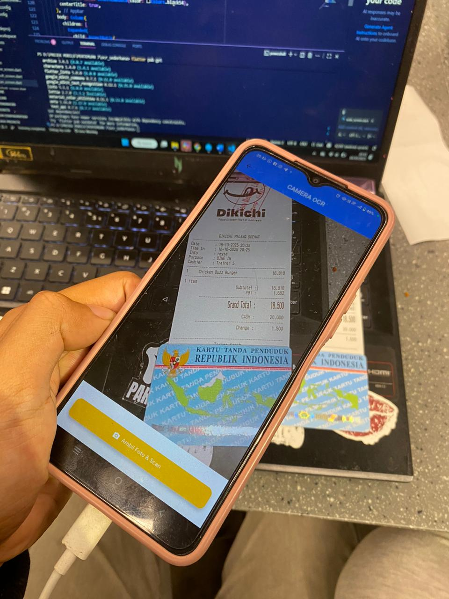
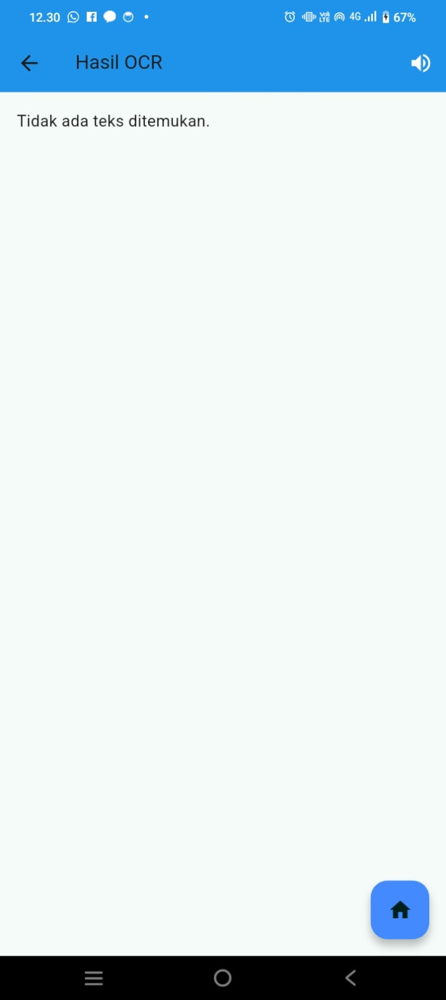
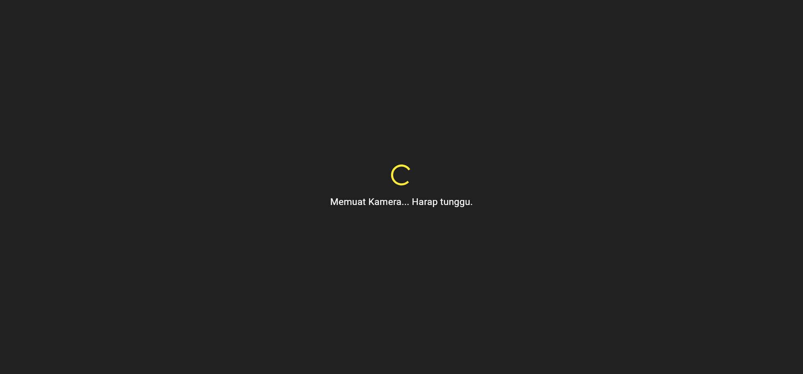
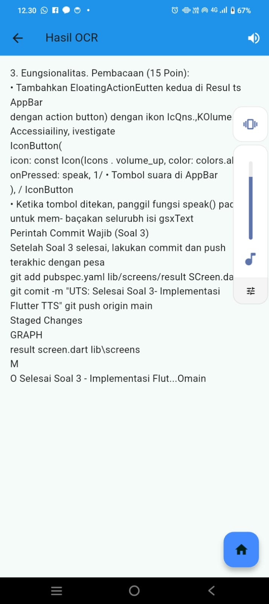
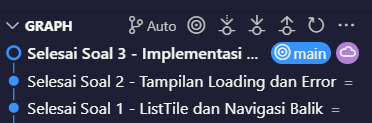

# Laporan Praktikum 7  
**Pemrograman Mobile - Plugin Flutter (OCR Sederhana)**  

---

## Identitas  
- **Nama**       : Randa Heru Kusuma  
- **NIM**        : 2341760009  
- **Praktikum**  : 7 - Optical Character Recognition (OCR)  

---

## Hasil  
Berikut adalah tampilan hasil praktikum 7:

Gambar 1. Tampilan halaman utama aplikasi OCR Sederhana.

Gambar 2. Tampilan aplikasi saat dijalankan di emulator atau perangkat HP.

Gambar 3. Proses pengambilan gambar dan hasil deteksi teks menggunakan fitur OCR.

---

## Deskripsi Praktikum  
Pada praktikum ini dipelajari cara membuat aplikasi **OCR (Optical Character Recognition)** sederhana menggunakan **Flutter**.  
Aplikasi ini berfungsi untuk mengambil gambar menggunakan kamera dan mengenali teks di dalam gambar menggunakan plugin **Google ML Kit Text Recognition**.  

Langkah-langkah yang dilakukan antara lain:  
1. Membuat proyek Flutter baru bernama `ocr_sederhana`.  
2. Menambahkan plugin **kamera** dan **ML Kit Text Recognition** ke dalam file `pubspec.yaml`.  
3. Menambahkan izin kamera dan penyimpanan pada file `AndroidManifest.xml`.  
4. Membuat struktur folder dan file utama seperti `main.dart`, `splash_screen.dart`, `home_screen.dart`, `scan_screen.dart`, dan `result_screen.dart`.  
5. Menjalankan aplikasi di emulator atau perangkat nyata untuk mengambil gambar dan mendeteksi teks.  

---

## Tugas Praktikum  
1. Jalankan aplikasi di emulator atau HP.  
2. Lakukan scan terhadap teks cetak (misalnya: buku, koran, atau layar HP).  
3. Amati hasil OCR yang muncul.  
   > Teks yang terdeteksi oleh sistem sesuai dengan tulisan pada gambar.  
   > Jika belum akurat, coba ambil ulang foto dengan pencahayaan yang lebih baik atau posisi teks lebih tegak dan jelas.  

---

### a. Apakah semua teks terbaca dengan akurat? Mengapa?  
Tidak semua teks selalu terbaca dengan akurat, karena hasil OCR dipengaruhi oleh kualitas gambar, pencahayaan, jenis font, dan ketegasan huruf.  

---

### b. Apa kegunaan fitur OCR dalam kehidupan sehari-hari?  
1. Memindai dokumen kertas menjadi file teks.  
2. Membaca tulisan dari foto atau nota belanja.  
3. Mengambil teks dari papan, buku, atau kartu nama.  
4. Membantu aksesibilitas bagi penyandang tunanetra dengan pembaca teks otomatis.  

---

### c. Sebutkan 2 contoh aplikasi nyata yang menggunakan OCR!  
1. **Google Lens** – mengenali dan menyalin teks dari gambar secara langsung.  
2. **CamScanner** – memindai dokumen kertas menjadi teks digital dan file PDF yang dapat diedit.  

---

## Kesimpulan  
Dari praktikum ini dapat disimpulkan bahwa teknologi **OCR** memungkinkan sistem untuk mengenali teks dari gambar dengan memanfaatkan pembelajaran mesin.  
Fitur ini sangat bermanfaat dalam digitalisasi dokumen, efisiensi kerja, dan peningkatan aksesibilitas bagi pengguna.

==================================================================================================================================

# 📘 Laporan UTS Flutter OCR App

## Identitas  
- **Nama**       : Randa Heru Kusuma  
- **NIM**        : 2341760009  
- **Praktikum**  : 7 - Optical Character Recognition (OCR)  
---

## Soal 1: Modifikasi Struktur Navigasi dan Aliran (30 Poin)

### Tujuan:
Menyederhanakan alur navigasi dan meningkatkan pengalaman pengguna di HomeScreen.

### 1. Pengubahan Navigasi Home (15 Poin)
• Ubah ElevatedButton di HomeScreen menjadi widget ListTile.  
• Atur ListTile dengan ikon kamera dan teks “Mulai Pindai Teks Baru”.  
• Fungsi onTap menggunakan Navigator.push() ke ScanScreen.

### 2. Teks Utuh dan Navigasi Balik (15 Poin)
• Hapus fungsi ocrText.replaceAll agar hasil teks ditampilkan utuh.  
• Tambahkan FloatingActionButton dengan ikon Home.  
• Navigasi kembali langsung ke HomeScreen menggunakan Navigator.pushAndRemoveUntil().

### Hasil:
  
*Jika icon home di klik maka kita akan kembali ke menu home awal
---

## Soal 2: Penyesuaian Tampilan dan Penanganan State/Error (40 Poin)

### Tujuan:
Memperbaiki tampilan loading dan memberikan feedback error yang lebih jelas.

### 1. Custom Loading Screen di ScanScreen (20 Poin)
• Tambahkan tampilan loading dengan latar abu gelap.  
• Tampilkan CircularProgressIndicator berwarna kuning.  
• Tambahkan teks “Memuat Kamera... Harap tunggu.”

### 2. Spesifikasi Pesan Error (20 Poin)
• Ubah pesan error SnackBar menjadi “Pemindaian Gagal! Periksa Izin Kamera atau coba lagi.”

### Hasil:

[HasilSoal 2.2](images/hasil2.2.png)    

---

## Soal 3: Implementasi Plugin Text-to-Speech (TTS) (30 Poin)

### Tujuan:
Mengintegrasikan fitur membaca teks secara lisan menggunakan plugin flutter_tts.

### 1. Instalasi Plugin (5 Poin)
• Tambahkan plugin flutter_tts ke file pubspec.yaml dan jalankan flutter pub get.

### 2. Konversi Widget dan Inisialisasi (10 Poin)
• Ubah ResultScreen menjadi StatefulWidget.  
• Inisialisasi FlutterTts dan atur bahasa ke Bahasa Indonesia.  
• Tambahkan dispose() untuk menghentikan TTS saat halaman ditutup.

### 3. Fungsionalitas Pembacaan (15 Poin)
• Tambahkan FloatingActionButton dengan ikon volume.  
• Saat ditekan, teks hasil OCR akan dibacakan oleh FlutterTts.

### Hasil:

*Saat di klik icon speaker maka aka keluar suara yang sudah di scan sebelumnnya

---
### Commit 3 Soal
Terdapat tiga commit utama yang menandakan penyelesaian tiap soal:

Selesai Soal 1 - ListTile dan Navigasi Balik
→ Berisi perubahan pada file home_screen.dart dan result_screen.dart untuk mengganti tombol menjadi ListTile serta menambahkan tombol home untuk navigasi balik.

Selesai Soal 2 - Tampilan Loading dan Error
→ Menunjukkan pembaruan di scan_screen.dart, menambahkan tampilan loading khusus dan memperbaiki pesan error saat pemindaian gagal.

Selesai Soal 3 - Implementasi Flutter TTS
→ Commit terakhir yang menandakan integrasi plugin flutter_tts serta penambahan fitur pembacaan teks hasil OCR.

## ✅ Kesimpulan
Aplikasi Flutter OCR kini memiliki:
- Navigasi lebih sederhana dengan ListTile.  
- Tampilan teks hasil pemindaian lebih natural.  
- Indikator loading kamera yang jelas.  
- Pesan error yang informatif.  
- Fitur pembacaan teks menggunakan Text-to-Speech.

---

